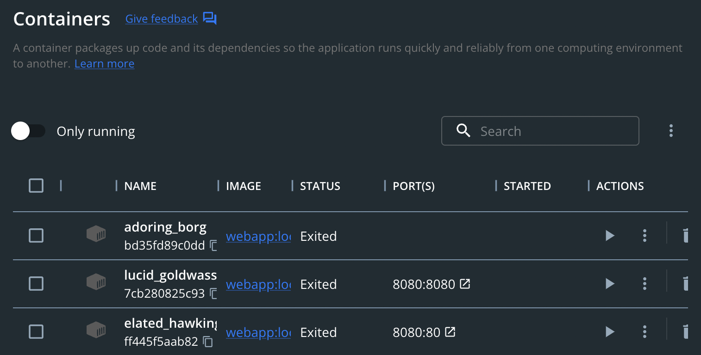
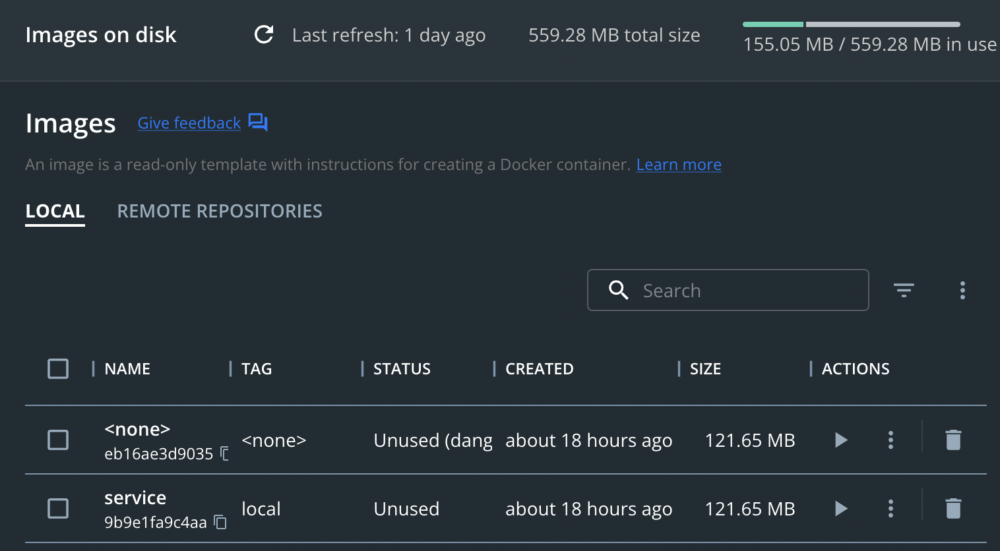

# Setup your local environment

## Overview

In this chapter you will make sure you have everything installed for running Docker locally.

## Docker desktop

Docker Desktop is a desktop app helping you to manage Docker resources with an UI.

**Note**: Docker Desktop is not necessary to use Docker, only Docker engine is needed.

- Go to [get docker](https://docs.docker.com/get-docker/) and install Docker Desktop for your laptop

- For MacOs, select your CPU type and install requirements.
  For Apple Silicon chips (mac m1), you will need to run:
> softwareupdate --install-rosetta

- Check your setup by checking Docker version
```
$ docker version
Client:
 Cloud integration: v1.0.29
 Version:           20.10.20
 API version:       1.41
 Go version:        go1.18.7
 Git commit:        9fdeb9c
 Built:             Tue Oct 18 18:20:35 2022
 OS/Arch:           darwin/arm64
 Context:           default
 Experimental:      true

Server: Docker Desktop 4.13.1 (90346)
 Engine:
  Version:          20.10.20
  API version:      1.41 (minimum version 1.12)
  Go version:       go1.18.7
  Git commit:       03df974
  Built:            Tue Oct 18 18:18:16 2022
  OS/Arch:          linux/arm64
  Experimental:     false
 containerd:
  Version:          1.6.8
  GitCommit:        9cd3357b7fd7218e4aec3eae239db1f68a5a6ec6
 runc:
  Version:          1.1.4
  GitCommit:        v1.1.4-0-g5fd4c4d
 docker-init:
  Version:          0.19.0
  GitCommit:        de40ad0
```

## Get to know Docker Desktop

Docker Desktop come with a dashboard to list and manage containers, images and volumes.





Remember what Docker Desktop hides:
- Docker engine. Responsible to run containers, download images, mount volumes ... It's the core of Docker.
- Docker daemon. The process running the Docker engine.
- Docker CLI. The tool to communicate with Docker engine.
