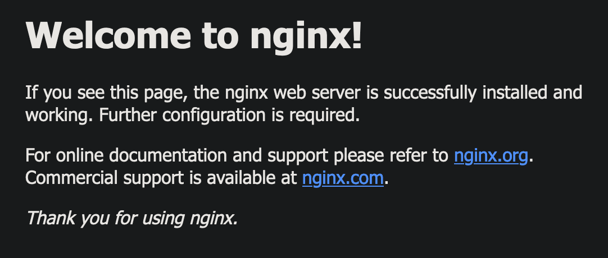

# Running your first container

## Overview

In this part, you will start your first container and explore Docker CLI commands.

## Pre requisite

- Docker Desktop started
- Or at least Docker engine running

# Step 1: Run your first container

We are going to use the Docker CLI to run our first container.

1. Open a terminal
2. Run `docker run -t ubuntu top`.\
  The command `docker run` start a container on your laptop. \
  The `-t` flags allocate a pseudo-TTY which we need for the top to work correctly.\
  `ubuntu` is the name of the Docker image in use for the container and `top` is the command that will run inside the container.
```
$ docker run -t ubuntu top
Unable to find image 'ubuntu:latest' locally
latest: Pulling from library/ubuntu
0509fae36eb0: Pull complete
Digest: sha256:4b1d0c4a2d2aaf63b37111f34eb9fa89fa1bf53dd6e4ca954d47caebca4005c2
Status: Downloaded newer image for ubuntu:latest
```
The `docker run` command will result first in a `docker pull` to download the ubuntu image onto your host. Once it is downloaded, it will start the container. The output for the running container should look like this:
```
top - 08:27:02 up 1 day, 12:06,  0 users,  load average: 0.00, 0.00, 0.00
Tasks:   1 total,   1 running,   0 sleeping,   0 stopped,   0 zombie
%Cpu(s):  0.0 us, 33.3 sy,  0.0 ni, 66.7 id,  0.0 wa,  0.0 hi,  0.0 si,  0.0 st
MiB Mem :   7850.5 total,   6853.3 free,    299.3 used,    697.9 buff/cache
MiB Swap:   1024.0 total,   1024.0 free,      0.0 used.   7070.4 avail Mem

  PID USER      PR  NI    VIRT    RES    SHR S  %CPU  %MEM     TIME+ COMMAND
    1 root      20   0    6728   2428   2104 R   0.0   0.0   0:00.01 top
```

**Some security stuff.**

What we see here is that the only process running on the container is the one started by the `top` command. If we do the same on the host, we would have a lot more process.

This is due to how containers work: they run in dedicated namespaces to provide isolation of system resources from other containers or the host. This way, they cannot interfere with processes from other containers or running on the host.

3. Interact with your newly created container.

Create new terminal and get the name of the running container with `docker ps`:

```
$ docker ps
CONTAINER ID   IMAGE     COMMAND   CREATED         STATUS         PORTS     NAMES
af827b918eb6   ubuntu    "top"     6 seconds ago   Up 5 seconds             optimistic_lalande
```
If no name is given at the container start, Docker give a random name to your container. You can also refer to your container using its ID.

Use this ID/name to run a shell inside your container:

```
$ docker exec -it af827b918eb6 bash
root@af827b918eb6:/#
```

Here it is, you are running a `bash` shell inside your container. Run the command `ps -ef` to see the list of running processes in your container. You will be able to see your running `top` command as well as the `bash` process.
```
root@af827b918eb6:/# ps -ef
UID        PID  PPID  C STIME TTY          TIME CMD
root         1     0  0 08:46 pts/0    00:00:00 top
root         7     0  0 08:48 pts/1    00:00:00 bash
root        18     7  0 08:50 pts/1    00:00:00 ps -ef
```

**Notes**: This is not the same as ssh'ing into a separate host or a VM. We don't need an ssh server to connect with a `bash` process.

4. Clean up the container running the `top` processes by typing: `<ctrl>-c`, list all containers and remove the containers by their id.
```
docker ps -a

docker rm <CONTAINER ID>
```

**Tips**: to delete all stopped containers at once, you can run `docker container prune`.

# Step 2: Running a simple web server

In this step we will run a Nginx web server, access it and update it.

1. Explore the Docker Hub

The [Docker Hub](https://hub.docker.com/search?q=&type=image) is the public central registry for Docker images, which contains community and official images.\
When searching for images you will find filters for "Docker Official Image", "Verified Publisher" and "Sponsored OSS" images. Select the "Docker Official Image" filter, to find images that are deemed enterprise-ready and are tested with Docker Enterprise Edition product. It is important to avoid using unverified content from the Docker Store when developing your own images that are intended to be deployed into the production environment. These unverified images may contain security vulnerabilities or possibly even malicious software.

For this step, we will use the [Nginx official image](https://hub.docker.com/_/nginx).

2. Run an Nginx server
  ```
  $ docker run --detach --publish 8080:80 --name nginx nginx:latest
  Unable to find image 'nginx:latest' locally
  latest: Pulling from library/nginx
  f3ac85625e76: Pull complete
  2f2ae0d10f0c: Pull complete
  686758060351: Pull complete
  9d6463e85319: Pull complete
  bb6dfee87e07: Pull complete
  594d75b0add1: Pull complete
  Digest: sha256:e209ac2f37c70c1e0e9873a5f7231e91dcd83fdf1178d8ed36c2ec09974210ba
  Status: Downloaded newer image for nginx:latest
  5e1bf0e6b926bd73a66f98b3cbe23d04189c16a43d55dd46b8486359f6fdf048
  ```

  We are using a couple of new flags here. The --detach flag will run this container in the background. To debug a detached container, you can access its logs using `docker logs [-f] <container name or id>`. The `publish` flag publishes port 80 in the container (the default port for nginx), via port 8080 on our host. The `--publish` flag is a feature that allows us to expose networking through the container onto the host.

  How do you know port 80 is the default port for nginx? Because it is listed in the [documentation](https://hub.docker.com/_/nginx) on the Docker Hub. In general, the documentation for the verified images is very good, and you will want to refer to them when running containers using those images.

  We are also specifying the `--name` flag, which names the container. Every container has a name, if you don't specify one, Docker will randomly assign one for you. Specifying your own name makes it easier to run subsequent commands on your container since you can reference the name instead of the id of the container. For example: `docker inspect nginx` instead of `docker inspect 5e1`.

  Since this is the first time you are running the nginx container, it will pull down the nginx image from the Docker Store. Subsequent containers created from the Nginx image will use the existing image located on your host.

  Nginx is a lightweight web server. You can now access it on port 8080 on your [localhost](http://localhost:8080).

  

3. Now that we have a web server running, we want to change the default page. In a new terminal, run a `bash` shell inside the container, the same way we did earlier:

```
$ docker exec -it nginx bash
```

You can find the index page at `/usr/share/nginx/html/index.html`. Let's update it:

```
echo "Hello World" > /usr/share/nginx/html/index.html
```

Reload your page, and see the change.

4. Updating files in a containers without to manipulate it manually ? Introducing volumes.

Manipulating files directly in a container is not a reliable process as any changes will disapear if the container is deleted. A proper method to do so is to use volumes.

Volumes allow us to mount a file or a directory directly in the container.

Delete your running nginx: `docker stop nginx && docker rm nginx` and start a new one. Be sure to be locate in this directory and run:

```
$ docker run --detach --publish 8080:80 --volume $(pwd)/index.html:/usr/share/nginx/html/index.html --name nginx nginx:latest
```

You have deployed a new container with the `--volume` tag. This way, you have mounted the `index.html` in this directory in the container at the path `/usr/share/nginx/html/index.html`. Nginx now serve your local `index.html` file and every update will be directly visible on [localhost](http://localhost:8080).

Volumes are a way to share data with your containers or between your containers. This is helpful when using Docker locally for testing, but for production container, we will not use volume to load our sources into our containers. We will define custom images.

4. Clean up

```
$ docker stop nginx && docker rm 
```

