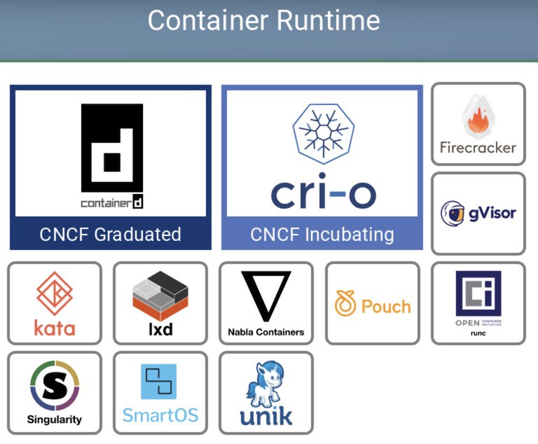

# Docker container workshop

# Introduction

Series of labs and instructions to introduce you to containers and Docker. Learn to run a container, inspect a container, create a Dockerfile, build an image from a Dockerfile and understand layers, tag and push images to a registry, and more.

# Presentation

0. What is docker and what it's not ?
1. Container vs VMs
2. Container, image and registry

## 0. What is Docker and what it's not ?

### Docker is:


- A company
- A tool (CLI, desktop app on MacOS)
- A registry to store images (Dockerhub)
- A daemon running an engine
- A Container Runtime Interface (CRI) aka a way to run containers

### **Containers != Docker**



- Containers are standardized by the [Open Container Initiative](https://opencontainers.org/) (OCI).
- Other Container Rutime Interface (CRI) exists (containerd, CRI-O …) and containers can be build/run without Docker.\
  For example, you can build and run container using `podman`.

## 1. Containers vs VMs


Containers and virtual machines are very similar resource virtualization technologies. Virtualization is the process in which a system singular resource like RAM, CPU, Disk, or Networking can be ‘virtualized’ and represented as multiple resources. The key differentiator between containers and virtual machines is that virtual machines virtualize an entire machine down to the **hardware layers** and containers only virtualize **software layers** above the operating system level.

## 2. Container, images and registries

### Some basic vocabulary

**Containers** are software packages that contain all the dependencies required to execute the contained software application. This package is described by an **image**. \
An **image** is build in layers, each layer describing an action: copy files, running commands, exposing port.\
Images are stored in a **registry**. The most famous one is [Dockerhub](hub.docker.com).

### Dockerfile

The Dockerfile is the file where you will configure your image. It start with the `FROM` keyword which define the base image you want to use. As a good practice, remember to set the tag of the base image. Using the `latest` tag, which refer to the latest version uploaded, may bring some un-controlled changes and therefor stability and security issues.
```Dockerfile
FROM python:3.9-slim-buster
```

Then, you can run command and add files to your image.
```Dockerfile
RUN mkdir /src
COPY ./requirements.txt /src/requirements.txt
COPY ./app /src
```

Declare and set default value for your environment variables.

```Dockerfile
ENV VARIABLE=default
```

And then define a command to run when starting. Note that only one process runs inside the Docker container.

```Dockerfile
CMD ["uvicorn", "app.main:app", "--host", "0.0.0.0", "--port", "80"]
```

These are some example of what you can do to configure your image. Check the [official documentation](https://docs.docker.com/engine/reference/builder/) for all the actions and keywords.

Building your own image will be explained during the lab.

**Good practices**

As images are build in layers, building a new version will use previous version layers. This way, a good practice to reduce build and download time is to declare actions which will require change more often at the end of the Dockerfile.

### Registry

Images are stored in registries. The best known is Dockerhub. AWS service is named Elastic Container Registry.

Registries good practices rules:
- Immutable tags. You should not be able to push a tag already existing.
- Encrypted at rest
- Continuouas security static scanning, for all currently used version as CVEs are discovered every day.

# Labs

- [0 - Setup](0-setup/README.md)
- [1 - Running your first container](1-first-container/README.md)
- [2 - Creating your own image](2-create-your-own-image/README.md)
- [3 - Hands on - micronaut apps](3-on-your-own/README.md)

# Documentation

- [Docker official documentation](https://docs.docker.com/)
- [Docker desktop documentation](https://docs.docker.com/desktop/)
- [Docker CLI documentation](https://docs.docker.com/engine/reference/commandline/cli/)
- [Dockerfile documentation](https://docs.docker.com/engine/reference/builder/)
- [Docker CLID documentation](https://docs.docker.com/engine/reference/builder/)